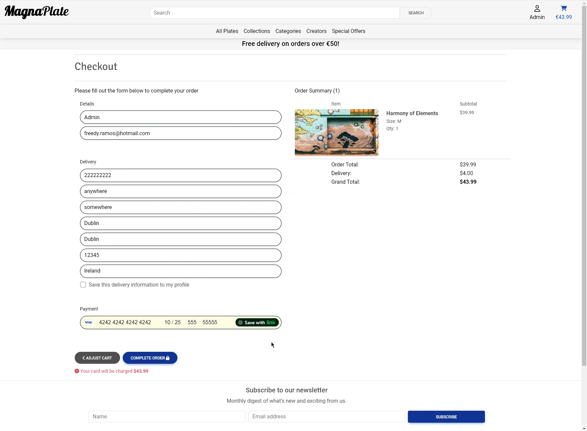

# MagnaPlate - Introduction

Welcome to the code repository for the "Magnaplate" E-commerce Store; a platform that not only showcases the magnetic poster products but also enables customers to purchase them online.

This project is highly relevant as the trend of online shopping continues to grow, with people increasingly looking to buy all sorts of items online, including unique and customizable decor items like magnetic posters. The website’s flexible design makes it suitable for any e-commerce business that requires customers to make purchases using a credit card before receiving the products.
 

[Live Project Here](https://magnaplate-3f8ee7baac73.herokuapp.com/)

README Table Content

- [MagnaPlate - Introduction](#)
  - [User Experience - UX](#user-experience---ux)
    - [User Stories](#user-stories)
    - [Agile Methodology](#agile-methodology)
    - [The Scope](#the-scope)
      - [Main Site Goals](#main-site-goals)
  - [Design](#design)
    - [Colours](#colours)
    - [Typography](#typography)
    - [Imagery](#imagery)
    - [Carousel](#carousel)
    - [Wireframes](#wireframes)
  - [Database Diagram](#database-diagram)
  - [Features](#features)
    - [Landing Page](#landing-page)
    - [Home Page - Images Carousel](#home-page---images-carousel)
    - [Home Page - Selected Products](#home-page---selected-products)
    - [Home Page - Image Banner](#home-page---image-banner)
    - [Home Page - Customers Reviews Carousel](#home-page---customers-reviews-carousel)
    - [Products Page](#products-page)
    - [Products Details](#products-details)
    - [Products Details - Features](#products-details---features)
    - [Products Details - Products on Sale](#products-details---products-on-sale)
    - [Products Shopping cart](#products-shopping-cart)
    - [Products Shopping cart - Products Coming Soon](#products-shopping-cart---products-coming-soon)
    - [Products Checkout](#products-checkout)
    - [Products Checkout - Success](#products-checkout---success)
    - [Products Management](#products-management)
    - [Profile Page](#profile-page)
      - [Service Reviews Page](#service-reviews-page)
      - [Add/Edit Service Review Page](#addedit-service-review-page)
    - [Signup Page](#signup-page)
    - [Signup Page - Verify Email](#signup-page---verify-email)
    - [Signup Page - Confirm Email](#signup-page---confirm-email)
    - [Login Page](#login-page)
    - [Logout Page](#logout-page)
    - [Reset Password Page](#reset-password-page)
    - [Change Password Page](#change-password-page)
    - [Navbar](#navbar)
    - [Footer](#footer)
    - [Page 404 - Page Not Found](#page-404---page-not-found)
  - [Messages and Interaction with Users](#messages-and-interaction-with-users)
    - [Sign up 1](#sign-up-1)
    - [Sign up 2](#sign-up-2)
    - [Login](#login)
    - [Logout](#logout)
    - [Profile Update](#profile-update)
    - [Service Review - Add Review](#service-review---add-review)
    - [Service Review - Update Review 1](#service-review---update-review-1)
    - [Service Review - Update Review 2](#service-review---update-review-2)
    - [Service Review - Delete Review 1](#service-review---delete-review-1)
    - [Service Review - Delete Review 2](#service-review---delete-review-2)
    - [Service Review - Delete Review 3](#service-review---delete-review-3)
    - [Add Product](#add-product)
    - [Edit Product 1](#edit-product-1)
    - [Edit Product 2](#edit-product-2)
    - [Edit Product 3](#edit-product-3)
    - [Delete Product 1](#delete-product-1)
    - [Delete Product 2](#delete-product-2)
    - [Delete Product 3](#delete-product-3)
    - [Add Product to cart](#add-product-to-cart)
    - [Update cart](#update-cart)
    - [Remove Product from cart](#remove-product-from-cart)
    - [Purchase Success](#purchase-success)
    - [Purchase Success - Confirmation Email](#purchase-success---confirmation-email)
  - [Admin Panel / Superuser](#admin-panel--superuser)
  - [Marketing and Social Media](#marketing-and-social-media)
    - [Statista - Facebook Users](#statista---facebook-users)
    - [MagnaPlate - Facebook Page](#facebook-page)
    - [Meta Pixel - Tracking Audience](#meta-pixel---tracking-audience)
    - [Mailchimp Subscription Service](#mailchimp-subscription-service)
  - [Privacy Policy](#privacy-policy)
  - [Search Engine Optimization](#search-engine-optimization)
    - [sitemap.xml](#sitemapxml)
    - [robots.txt](#robotstxt)
    - [Sitemap Google Registration](#sitemap-google-registration)
  - [AWS Setup Process](#aws-setup-process)
    - [AWS S3 Bucket](#aws-s3-bucket)
    - [IAM Set Up](#iam-set-up)
    - [Connecting AWS to the Project](#connecting-aws-to-the-project)
  - [Stripe Payments](#stripe-payments)
    - [Payments](#payments)
    - [Webhooks](#webhooks)
  - [Technologies Used](#technologies-used)
    - [Languages Used](#languages-used)
    - [Django Packages](#django-packages)
    - [Frameworks - Libraries - Programs Used](#frameworks---libraries---programs-used)
    - [Testing](#testing)
  - [Creating the Django app](#creating-the-django-app)
  - [Deployment of This Project](#deployment-of-this-project)
  - [Final Deployment](#final-deployment)
  - [Forking This Project](#forking-this-project)
  - [Cloning This Project](#cloning-this-project)
  - [Credits](#credits)
    - [Content](#content)
    - [Information Sources / Resources](#information-sources--resources)
  - [Special Thanks](#special-thanks)

## User Experience - UX

### User Stories

#### As a Site User
| id  |  Content | Label |
| ------ | ------ | ------ |
| [2](https://github.com/Freedy-FR/CI-P5-MagnaPlate/issues/2) | As a Site User, I can view top navigation for easy access to website main functions. | Must Have |
| [3](https://github.com/Freedy-FR/CI-P5-MagnaPlate/issues/3) | As a Site User, I can view the main navigation for easy access to products and deals. | Must Have |
| [4](https://github.com/Freedy-FR/CI-P5-MagnaPlate/issues/4) | As a Site User, I can register, log in, and log out to access the main features of the website. | Must Have |
| [5](https://github.com/Freedy-FR/CI-P5-MagnaPlate/issues/5) | As a Site User, I can use a search system for easy access to specific products and deals. | Must Have |
| [6](https://github.com/Freedy-FR/CI-P5-MagnaPlate/issues/6) | As a Site User, I can view a carousel of images on the main page to see the main deals and collections. | Should Have |
| [7](https://github.com/Freedy-FR/CI-P5-MagnaPlate/issues/7) | As a Site User, I can view detailed product information, images, and options to buy or add to favorites. | Must Have |
| [8](https://github.com/Freedy-FR/CI-P5-MagnaPlate/issues/8) | As a Site User, I can add products to a favorites page for easy access to my favorite products. | Must Have |
| [9](https://github.com/Freedy-FR/CI-P5-MagnaPlate/issues/9) | As a Site User, I can add products to the shopping cart, view purchase details, and complete the purchase. | Must Have |
| [10](https://github.com/Freedy-FR/CI-P5-MagnaPlate/issues/10) | As a Site User, I can sign up for a newsletter to receive email updates about new products. | Should Have |
| [11](https://github.com/Freedy-FR/CI-P5-MagnaPlate/issues/11) | As a Site User, I can access my account profile page to manage personal information and preferences. | Must Have |
| [12](https://github.com/Freedy-FR/CI-P5-MagnaPlate/issues/12) | As a Site User, I can access the order management page to review and manage previous orders. | Must Have |
| [13](https://github.com/Freedy-FR/CI-P5-MagnaPlate/issues/13) | As a Site User, I can add products to the cart, preparing for purchase. | Must Have |
| [14](https://github.com/Freedy-FR/CI-P5-MagnaPlate/issues/14) | As a Site User, I can edit the contents of their shopping cart, including updating quantities. | Must Have |
| [15](https://github.com/Freedy-FR/CI-P5-MagnaPlate/issues/15) | As a Site User, I can remove items from their shopping cart. | Must Have |
| [16](https://github.com/Freedy-FR/CI-P5-MagnaPlate/issues/16) | As a Site User, I can view a paginated list of products to easily select a product for viewing. | Must Have |
| [17](https://github.com/Freedy-FR/CI-P5-MagnaPlate/issues/17) | As a Site User, I can switch between dark and light themes for optimal viewing in different lighting environments. | Could Have |
| [18](https://github.com/Freedy-FR/CI-P5-MagnaPlate/issues/18) | As a Site User, I can see site notifications to receive feedback on my actions. | Should Have |
| [19](https://github.com/Freedy-FR/CI-P5-MagnaPlate/issues/19) | As a Site User, I have the option to leave product reviews and ratings. | Could Have |
| [24](https://github.com/Freedy-FR/CI-P5-MagnaPlate/issues/24) | As a Site User, I can view a footer for easy access to website functions. | Must Have |
| [25](https://github.com/Freedy-FR/CI-P5-MagnaPlate/issues/25) | As a Site User, I can use a sorting system for easy access to specific products and deals. | Must Have |
| [30](https://github.com/Freedy-FR/CI-P5-MagnaPlate/issues/30) | As a Site User, I can access the Carousel management page to review and manage the images and text on the carousel. | Should Have |
| [31](https://github.com/Freedy-FR/CI-P5-MagnaPlate/issues/31) | As a Site User, I can see a list of all creators and click on them to see more details and their related products. | Must Have |
| [32](https://github.com/Freedy-FR/CI-P5-MagnaPlate/issues/32) | As a Site User, I want the project's style to be consistent across all pages and components, so that the user experience is seamless and professional. | Should Have |

#### As a Site Admin
| id  |  Content | Label |
| ------ | ------ | ------ |
| [20](https://github.com/Freedy-FR/CI-P5-MagnaPlate/issues/20) | As a Site Admin, I can process payments using the Stripe gateway. | Must Have |
| [21](https://github.com/Freedy-FR/CI-P5-MagnaPlate/issues/21) | As a Site Admin, I can add new products to the website's database. | Must Have |
| [22](https://github.com/Freedy-FR/CI-P5-MagnaPlate/issues/22) | As a Site Admin, I can delete products from the website's database. | Must Have |
| [23](https://github.com/Freedy-FR/CI-P5-MagnaPlate/issues/23) | As a Site Admin, I can edit and update product information in the website's database. | Must Have |
| [26](https://github.com/Freedy-FR/CI-P5-MagnaPlate/issues/26) | As a Site Admin, I can add, remove or edit collections to the website's database. | Must Have |
| [28](https://github.com/Freedy-FR/CI-P5-MagnaPlate/issues/28) | As a Site Admin, I can add, remove or edit creators to the website's database. | Must Have |
| [29](https://github.com/Freedy-FR/CI-P5-MagnaPlate/issues/29) | As a Site Admin, I can add, remove or edit categories to the website's database. | Must Have |
| [40](https://github.com/Freedy-FR/CI-P5-MagnaPlate/issues/40) | As a Site Admin, I can manage product collections. | Must Have |
| [41](https://github.com/Freedy-FR/CI-P5-MagnaPlate/issues/41) | As a Site Admin, I can edit products in the database. | Must Have |
| [42](https://github.com/Freedy-FR/CI-P5-MagnaPlate/issues/42) | As a Site Admin, I can delete products from the database. | Must Have |
| [43](https://github.com/Freedy-FR/CI-P5-MagnaPlate/issues/43) | As a Site Admin, I can add products to the database. | Must Have |
| [44](https://github.com/Freedy-FR/CI-P5-MagnaPlate/issues/44) | As a Site Admin, I can process payments using Stripe. | Must Have |

#### As a Developer
| id  |  Content | Label |
| ------ | ------ | ------ |
| [33](https://github.com/Freedy-FR/CI-P5-MagnaPlate/issues/33) | As a Developer, I want the codebase to follow consistent coding standards, so that it is easy to maintain, understand, and collaborate on. | Must Have |
| [34](https://github.com/Freedy-FR/CI-P5-MagnaPlate/issues/34) | As a Developer,I want to implement SEO best practices on our website,so that the website ranks higher in search engine results and attracts more organic traffic. | Must Have |
| [35](https://github.com/Freedy-FR/CI-P5-MagnaPlate/issues/35) | As a Developer, I want a comprehensive documentation system so that it is easy to understand, maintain, and collaborate on the codebase. | Documentation Implementation |

### Agile Methodology

The agile planning approach was employed in the development of this site, wherein each user feature was broken down into individual user stories, each accompanied by specific acceptance criteria. These criteria were then translated into tasks, serving as markers of completion for the respective user stories.

To enhance functionality, interconnected user stories that contributed to specific site features were grouped into broader Epics. User stories were categorized as Must Have, Should Have, or Could Have, aiding in prioritization during the implementation process.

As the site evolved, tasks were refined or adapted based on changing user needs and a more mature understanding of project requirements. GitHub Issues and the Kanban board within the GitHub Projects view served as the structural framework. The project was organized into several sections:

* To Do - Serving as the initial repository for all user stories.
* In Progress - Active development stories were tracked in this phase.
* Done - Successfully developed stories found their place here.
* Future - This section was reserved for 'could have' stories containing features earmarked for potential implementation at a later stage due to time limitations.

Feel free to explore the Kanban Board for a visual representation of the user stories [here](https://github.com/users/Freedy-FR/projects/6).

### The Scope

#### Main Site Goals

- To provide users with comprehensive information about the products, including detailed product information, images, and options to buy or add to favorites.
- To provide users with a visually pleasing website that is intuitive and easy to navigate, with clear and consistent navigation options.
- To provide a website with a clear purpose, ensuring that users can easily access key functionalities such as account management, order management, and product browsing.
- To provide tools that allow users to search for products, including a search system and sorting options for easy access to specific products and deals.
- To provide users with an easy and safe way to buy their products, ensuring secure payment processing through Stripe, a well-organized shopping cart system, and clear checkout procedures.

## Design

### Colour Scheme for MagnaPlate Website

The Colour scheme for the MagnaPlate website was meticulously selected to enrich the visual appeal of the plates (posters) and provide an engaging user experience. The Colours were chosen from [Coolors](https://coolors.co/), ensuring a harmonious blend that enhances the aesthetic quality of the site.

#### Colour Palette:

- **FBFBFB (White)**: This bright, clean shade is used for the background, offering a crisp and neutral canvas that makes other Colours and content stand out.

- **EEEEEE (Light Gray)**: A soft, light gray tone that adds subtle depth and contrast to the design elements without overpowering them.

- **4F4F4F (Medium Gray)**: Used for text and secondary elements, this medium gray ensures readability and complements the overall Colour scheme.

- **000000 (Black)**: The primary Colour for text, providing strong contrast and excellent legibility against the white and light gray backgrounds.

- **2846A1 (Dark Blue)**: This deep blue shade is employed in headers and key navigation elements, evoking a sense of trust and stability.

- **1C4AB2 (Blue)**: A vibrant blue used for links and call-to-action buttons, drawing attention without being too aggressive.

- **133398 (Navy Blue)**: Incorporated in the logo and other prominent elements, this navy blue adds a touch of professionalism and sophistication.

- **B81916 (Red)**: This bold red is used sparingly to highlight important information and create a sense of urgency or importance.

- **A10F0D (Dark Red)**: A darker red shade that complements the bold red, adding depth and visual interest to the design.

The use of these Colours has been consistently maintained throughout the website and checked for contrast to allow easy accessibility. The combination of these carefully selected Colours ensures that the MagnaPlate website is not only visually appealing but also user-friendly and accessible to all visitors.

  

Colour palette

  
  

   

### Typography

[Google Fonts](https://fonts.google.com/) were used as below:

* Galada is used for the Logo.
* Signika Negative is used for the Headings.
* Roboto is used for the body of the text.

### Imagery

The MagnaPlate website relies on thumbnails to render nice images, enhancing both efficiency and aesthetics. Thumbnails are rendered on the products page to help with quick loading times, while the product detail pages display the full image. Users also have the option to view images in full screen using [fslightbox](https://fslightbox.com), allowing them to see every detail clearly.

The images and placeholders were sourced from [Pexels](https://www.pexels.com/) and some images were generated using AI with ChatGPT, while the Favicon icon was obtained from [Favicon](https://favicon.io/). Some of the images have also been sourced from a Discord group, noted in the credits.

### Carousel

The carousel on the MagnaPlate website serves as a dynamic and engaging feature to showcase key highlights and promotions. The design of the carousel includes the following elements:

- **Responsive Design**: The carousel is fully responsive, ensuring it looks great on all devices, from desktops to mobile phones.

- **High-Quality Thumbnails**: Each slide in the carousel displays a high-quality thumbnail image, providing a preview of the featured content.

- **Gradient Background**: The gradient background transitions smoothly between shades of blue and red, creating a visually appealing backdrop that enhances the displayed images.

- **Navigation Arrows**: Discreet navigation arrows are placed on either side of the carousel, allowing users to easily browse through the slides.

- **Featured Content**: The carousel prominently features key promotional images, such as new arrivals, special offers, and featured collections, to draw attention and engage users.

- **Efficiency and Aesthetics**: Thumbnails are used in the carousel to maintain quick loading times and enhance the aesthetic appeal of the website.

The use of the carousel helps to keep the website dynamic and interactive, providing users with a visually rich experience that highlights important content and promotions effectively.

### Wireframes

Wireframes were created for desktop/laptop, tablet and mobile.

  

Home

  
  

   

  

Products

  
  

   

  

 Products Detail

  
  

   

  

Cart

  
  

   

  

My Profile - Basic Information

  
  

   

  

My Profile - Shipping Address

  
  

   

  

My Profile - Orders

  
  

   

  

Admin - Product Management

  
  

   

## Magna Plate Database

The project encompasses a variety of models for managing orders, favorites, newsletters, carousels, products, and user profiles. Below is an overview of these models, categorized by their functionality. In total, there are 13 models, with 10 being custom models.

### **Summary**

In total, there are **13 models**:
- **10 Custom Models**:
  - `FavoriteProduct`
  - `FavoriteCreator`
  - `NewsletterSubscribedInfo`
  - `NewsletterSendEmail`
  - `CustomerSupportInquiry`
  - `Carousel`
  - `Collection`
  - `Category`
  - `Creator`
  - `UserProfile`
- **3 Non-Custom Models**:
  - `Order`
  - `OrderLineItem`
  - `Product`

### Database Diagram

  

Magna Plate Database

  
  

   

#### Checkout

**Order Model**

The `Order` model records all relevant details about a user's order.

- `order_number` - Unique identifier for the order.
- `user_profile` - ForeignKey to the `UserProfile` model.
- `full_name` - User's full name.
- `email` - User's email.
- `delivery_phone_number` - User's phone number for delivery.
- `country` - User's country (using `CountryField`).
- `postcode` - Postal code of the delivery address.
- `town_or_city` - Town or city of the delivery address.
- `street_address1` - First line of the street address.
- `street_address2` - Second line of the street address.
- `county` - County of the delivery address.
- `date` - Date and time when the order was placed.
- `delivery_cost` - Cost of delivery.
- `order_total` - Total cost of items in the order.
- `grand_total` - Total cost including delivery.
- `original_cart` - JSON representation of the original shopping cart.
- `stripe_pid` - Stripe payment intent ID.

**OrderLineItem Model**

The `OrderLineItem` model details the specific items within an order.

- `order` - ForeignKey to the `Order` model.
- `product` - ForeignKey to the `Product` model.
- `product_size` - Size of the product.
- `quantity` - Quantity of the product.
- `lineitem_total` - Total price for the line item.

---

#### Favorites

**FavoriteProduct Model** ---- > Custom model

Tracks a user's favorite products.

- `user` - ForeignKey to the `User` model.
- `product` - ForeignKey to the `Product` model.
- `is_favorite` - Whether the product is marked as a favorite.
- `created_at` - Timestamp of when the favorite was created.

**FavoriteCreator Model** ---- > Custom model

Tracks a user's favorite creators.

- `user` - ForeignKey to the `User` model.
- `creator` - ForeignKey to the `Creator` model.
- `is_favorite` - Whether the creator is marked as a favorite.
- `created_at` - Timestamp of when the favorite was created.

---

#### Footer

**NewsletterSubscribedInfo Model** ---- > Custom model

Stores information about newsletter subscribers.

- `name` - Subscriber's name.
- `email` - Subscriber's email address.
- `created_at` - Timestamp of subscription.

**NewsletterSendEmail Model** ---- > Custom model

Details for sending out newsletter emails.

- `subject` - Subject of the email.
- `body` - Body content of the email.
- `created_at` - Timestamp when the email was created.
- `send_now` - Flag to indicate if the email should be sent immediately.
- `recipients` - ManyToManyField to `NewsletterSubscribedInfo`.
- `letter_sent` - Indicates whether the email has been sent.

**CustomerSupportInquiry Model** ---- > Custom model

Handles customer support inquiries.

- `name` - Name of the person making the inquiry.
- `email` - Email address of the person making the inquiry.
- `subject` - Subject of the inquiry.
- `message` - Detailed message of the inquiry.
- `enquiry_type` - Type of inquiry (e.g., Order, Product, Shipping).
- `order_number` - Order number related to the inquiry (optional).
- `ticket_number` - Unique ticket number for the inquiry.
- `created_at` - Timestamp of when the inquiry was created.

---

#### Home

**Carousel Model** ---- > Custom model

Represents items in the homepage carousel.

- `image` - Image associated with the carousel item.
- `link` - URL link for the carousel item.
- `caption` - Caption for the carousel item.
- `order` - Order of the carousel item.

---

#### Products

**Collection Model** ---- > Custom model

Represents a collection of products.

- `name` - Name of the collection.
- `friendly_name` - Friendly name of the collection.

**Category Model** ---- > Custom model

Represents a category of products.

- `name` - Name of the category.
- `friendly_name` - Friendly name of the category.
- `collection` - ForeignKey to the `Collection` model.

**Creator Model** ---- > Custom model

Details about creators of products.

- `name` - Name of the creator.
- `image` - Image of the creator.
- `description` - Description of the creator.

**Product Model**

Represents an individual product in the store.

- `category` - ForeignKey to the `Category` model.
- `collection` - ForeignKey to the `Collection` model.
- `creator` - ForeignKey to the `Creator` model.
- `sku` - Unique stock keeping unit.
- `name` - Name of the product.
- `description` - Product description.
- `has_sizes` - Indicates if the product has size options.
- `size` - Size of the product (if applicable).
- `rating` - Product rating.
- `image_url` - URL of the product image.
- `image` - Image of the product.
- `thumbnail` - Thumbnail image of the product.
- `price` - Price of the product.
- `is_on_deal` - Indicates if the product is on deal.
- `created_at` - Timestamp when the product was created.

---

#### Profile

**UserProfile Model** ---- > Custom model

Stores additional information about a user.

- `user` - OneToOneField to the `User` model.
- `default_contact_full_name` - User's default contact full name.
- `default_contact_email` - User's default contact email.
- `default_contact_phone_number` - User's default contact phone number.
- `default_delivery_phone_number` - User's default delivery phone number.
- `default_country` - User's default country (using `CountryField`).
- `default_postcode` - User's default postal code.
- `default_town_or_city` - User's default town or city.
- `default_street_address1` - User's default street address (line 1).
- `default_street_address2` - User's default street address (line 2).
- `default_county` - User's default county.

---

## Features

### Home Page - Images Carousel

- The home page includes a carousel showcasing images at the top, which can be used for promotions, highlights, or important announcements. 

  

Home Page - Images Carousel

  
  

   

### Home Page - Deals

- The Deals section features products with discounted prices or special promotions, displayed at random to ensure a fresh and varied selection each time users visit. 

  

Home Page - Deals

  
  

   

### Home Page - Products

- The Products section on the home page highlights a selection of featured items, new arrivals, or top sellers, offering users a quick view of popular and interesting products. 

  

Home Page - Products

  
  

   
  

### Home Page - Image Banner

- Features a prominent image banner that can be used for announcements or promotions. 

  

Home Page - Image Banner

  
  

   

### Home Page - Main Navigation Bar

- The Main Navigation Bar provides easy access to all key sections of the website. It includes links to All Plates, Collections, Categories, Creators, and Special Offers.
 Additionally, it features a search bar for quick product searches, a user account icon for profile access, and a shopping cart icon displaying the current cart total. This intuitive navigation bar ensures users can effortlessly explore and navigate the website. 

  

Home Page - Main Navigation Bar

  
  

   

### Search Bar

- The Search Bar allows users to quickly find products, collections, categories, and creators on the MagnaPlate website. Located prominently at the top of the page, it provides an easy way for users to navigate and discover specific items they are looking for by entering keywords or phrases.

  

Search Bar

  
  

   

### Products Page

- Displays a comprehensive list of all available products with filtering and sorting options. 

  

Products Page

  
  

   

### Products Page - Sorting

- Allows users to organize products by various criteria such as price, popularity. This feature helps users find what they're looking for more efficiently. 

  

Products Page - Sorting

  
  

   

### Products Page - Hover Overlay (Laptops/Desktops)

- Displays additional product details or actions when users hover over a product image. This overlay enhances user interaction by providing quick access to essential information. 

  

Products Page - Hover Overlay

  
  

   

### Product Details

- The Product Details page offers a comprehensive view of each product. Users can see high-resolution full screen images, detailed descriptions, user ratings, and prices. It also provides options to select size and quantity before adding items to the cart. Additionally, the page includes tabs for detailed specifications and shipping information to ensure users have all necessary details. This dynamic presentation enhances the shopping experience by providing a thorough overview of each product. 

  

Product Details

  
  

   

  

Product Details - Add to Cart

  
  

   

### All Creators Page

- The All Creators page showcases all the artists and creators featured on the platform. Users can browse through the list of creators, view their profiles, and explore their collections. This page provides an excellent way to discover new artists and follow their work, enhancing the community and diversity of the platform. 

  

All Creators Page

  
  

   

### Creators Details

- The Creators Details page provides an in-depth look at individual creators. Users can learn more about each creator, view their biography, and explore the collections and products they have created. This page helps users connect with the creators and gain insight into their artistic journey and inspirations. 

  

Creators Details

  
  

   

### Shopping Cart

- The Shopping Cart page allows users to review the items they intend to purchase. It displays product images, names, sizes, SKUs, prices, and quantities. Users can update quantities or remove items directly from the cart. The page also shows the subtotal, delivery cost, and grand total, with options to continue shopping or proceed to secure checkout. This dynamic interface ensures a smooth and efficient shopping experience. 

  

Shopping Cart

  
  

   

### Checkout

- The Checkout page allows users to review their order, enter delivery and payment details, and complete their purchase. Users can see a summary of items in their cart, fill in their shipping information, and input payment details securely. This streamlined process ensures a smooth and efficient checkout experience, helping users finalize their orders with ease. 

  

Checkout

  
  

   

### Checkout - Success

- The Checkout Success page confirms that the user's purchase has been completed successfully. It displays an order summary, including product details, sizes, quantities, and subtotals. Additionally, it provides delivery information and the total amount charged. This page reassures users that their order has been processed and includes all relevant details for their reference. 

  

Checkout - Success

  
  

   

  

Site Management

  
  

   

### Profile Page

- The Profile Page allows users to view and update their personal information and check order history. Users can edit their contact details, manage their delivery addresses, and review their past orders. This section ensures that users can easily keep their profile information current and track their purchases. 

  

Profile Page

  
  

   

#### My Favorites

- The My Favorites section allows users to save and manage their favorite products and creators for easy access later. Users can quickly view and navigate to their preferred items and creators, making it convenient to revisit what they are interested in. This feature enhances the shopping experience by enabling users to curate a personalized collection of their favorite products and creators. 

  

My Favorites

  
  

   

  

My Favorites - Add Products

  
  

   

  

My Favorites - Add Creators

  
  

   

### Register Page

- The Register Page allows new users to create an account by providing their personal details such as name, email, and password. This page ensures a smooth sign-up process, enabling users to quickly join the platform and start enjoying its features. 

  

Register Page

  
  

   

### Register Page - Verify Email

- The Verify Email page is part of the registration process, where users are required to verify their email address to complete the signup. This step ensures that the email provided is valid and helps in securing the user's account. 

  

Register Page - Email

  
  

   

  

Register Page - Verify Email

  
  

   

### Register Page - Confirm Email

- The Confirm Email page is shown after a user verifies their email address. This page confirms that the email address has been successfully verified, completing the registration process and allowing the user to access all the features of the platform. 

  

Register Page - Confirm Email

  
  

   

### Login Page

- The Login Page allows existing users to log in to their account by entering their email and password. This page ensures secure access to user accounts, enabling them to manage their profiles, view order history, and make purchases. 

  

Login Page

  
  

   

### Logout Page

- The Logout Page is shown after a user logs out of their account. This page confirms that the user has successfully logged out, providing options to return to the home page or log back in. 

  

Logout Page

  
  

   

### Footer

- The footer section contains additional links to various parts of the website, contact information, and other relevant details. It provides quick access to important sections such as Home, About Us, Products, Deals, and support pages like FAQ and Customer Support. The footer also includes social media links for easy navigation to the website's social media profiles. Additionally, there is a subscription form for the newsletter, allowing users to stay updated with the latest news and offers. 

  

Footer

  
  

   

### About Us

- The About Us page provides an overview of MagnaPlate's mission, history, and core values. Learn about our dedication to revolutionizing wall decoration with innovative metallic posters, our journey since our founding in 2024, and the principles that guide our work. 

  

About Us

  
  

   

### FAQ Page

- The FAQ page provides answers to the most frequently asked questions about MagnaPlate's products, services, and policies. This section is designed to help users find quick solutions to common issues and learn more about our offerings. 

  

FAQ Page

  
  

   

### Customer Support Page

- The Customer Support Page provides a form for users to fill out if they have any questions or need assistance. Users can enter their name, email, subject, and message. After submission, they will receive a confirmation with a ticket number for tracking their request.

  

Customer Support Page

  
  

   

  

Customer Support Confirmation

  
  

   

### Contact Us Page

- The Contact Us Page allows users to get in touch with our support team for any inquiries or issues. Users can fill out their details and submit their message through the provided form.

  

Contact Us Page

  
  

   

### Social Media

- Our social media section allows you to stay connected and engaged with MagnaPlate. Follow us on various platforms for the latest updates, exclusive promotions, and exciting news about our innovative products.

  

Social Media

  
  

   

### Newsletter Section

- The newsletter section in the footer of MagnaPlate's website allows users to stay connected with the latest updates, special promotions, and exclusive offers. By subscribing, you can receive timely notifications about new arrivals and exciting deals directly in your inbox. Enter your email address in the footer section to join our community and never miss out on any important updates from MagnaPlate.

  

Newsletter Section

  
  

   

### 404 Error Page

- The 404 Error Page is displayed when a user tries to access a page that does not exist on the MagnaPlate website. This page informs the user that the requested page could not be found and provides navigation options to help them return to the main site or find what they are looking for.

  

404 Error Page

  
  

   

## Site Management - Features

### Product Management - Add Product

- The Product Management section allows admins to manage the product listings on the MagnaPlate website. This includes adding new products, editing existing ones, or deleting products that are no longer available. This section ensures that the product catalog is always up to date and accurately reflects the inventory.

  

Product Management - Add Product

  
  

   

### Product Management - Edit Product

- The Product Management section also enables admins to edit existing products. This feature allows for modifications to product details, such as updating descriptions, changing prices, adjusting inventory levels, and more. This functionality ensures that all product information is current and accurate.

  

Product Management - Edit Product

  
  

   

### Product Management - Delete Product

- The Product Management section also provides the functionality for admins to delete products. This feature allows for the removal of products that are no longer available or needed, helping to maintain an accurate and up-to-date product catalog.

  

Product Management - Delete Product

  
  

   

### Creator Management - Add Creator

- The Creator Management section allows admins to manage the creators listed on the MagnaPlate website. The "Add Creator" feature enables admins to introduce new creators to the platform. This ensures the website continually showcases fresh talent and maintains an updated roster of contributors.

  

Creator Management - Add Creator

  
  

   

### Creator Management - Edit Creator

- The Creator Management section allows admins to manage the creators listed on the MagnaPlate website. The "Edit Creator" feature provides admins with the capability to modify the details of existing creators. This helps in keeping the creator information current and relevant, ensuring accurate representation on the platform.

  

Creator Management - Edit Creator

  
  

   

### Creator Management - Delete Creator

- The Creator Management section allows admins to manage the creators listed on the MagnaPlate website. The "Delete Creator" feature allows admins to remove creators who are no longer associated with the platform. This function helps in maintaining a clean and updated creator directory, reflecting only active contributors.

  

Creator Management - Delete Creator

  
  

   

### Collection Management - Add Collection

- The Collection Management page allows admins to add new collections to the MagnaPlate catalog. This feature includes fields for collection details, associated products, and more, ensuring that new collections can be seamlessly integrated into the existing lineup. Admins can also edit or delete collections from this page to keep the catalog up-to-date.

  

Collection Management

  
  

   

### Collection Management - Edit Collection

- The Collection Management page allows admins to edit existing collections in the MagnaPlate catalog. This feature includes fields for modifying collection details, associated products, and more, ensuring that collections can be updated to reflect current offerings. Admins can also add or delete collections from this page.

  

Collection Management

  
  

   

### Collection Management - Delete Collection

- The Collection Management page allows admins to delete collections from the MagnaPlate catalog. This feature ensures that outdated or irrelevant collections can be removed, keeping the catalog up-to-date and relevant.

  

Collection Management

  
  

   

### Category Management - Add Category

- The Category Management page allows admins to add new categories to the MagnaPlate catalog. This feature includes fields for category details, ensuring that new categories can be seamlessly integrated into the existing structure. 

  

Category Management

  
  

   

### Category Management - Edit Category

- The Category Management page allows admins to edit existing categories in the MagnaPlate catalog. This feature includes fields for modifying category details, ensuring that categories can be updated to reflect current offerings. Admins can also add or delete categories from this page to keep the catalog organized and up-to-date.

  

Category Management

  
  

   

### Category Management - Delete Category

- The Category Management page allows admins to delete categories from the MagnaPlate catalog. This feature ensures that outdated or irrelevant categories can be removed, keeping the catalog organized and up-to-date.

  

Category Management

  
  

   

### Carousel Management - Add Carousel

- The Carousel Management page allows admins to add new carousels to the MagnaPlate catalog. This feature includes fields for carousel details, ensuring that new carousels can be seamlessly integrated into the existing structure.

  

Carousel Management

  
  

   

### Carousel Management - Edit Carousel

- The Carousel Management page allows admins to edit existing carousels in the MagnaPlate catalog. This feature includes fields for modifying carousel details, ensuring that carousels can be updated to reflect current offerings. Admins can also add or delete carousels from this page to keep the catalog visually appealing and up-to-date.

  

Carousel Management

  
  

   

### Carousel Management - Delete Carousel

- The Carousel Management page allows admins to delete carousels from the MagnaPlate catalog. This feature ensures that outdated or irrelevant carousels can be removed, keeping the catalog visually appealing and up-to-date.

  

Carousel Management

  
  

   

### Newsletter Management - Create/Send Newsletter

- The Newsletter Management page allows admins to create and send newsletters to subscribers. This feature includes fields for newsletter details, ensuring that new newsletters can be seamlessly created and sent to the mailing list. 

  

Newsletter Create/Send

  
  

   

- After sending the newsletter, a confirmation message is shown, and a green tick can be seen indicating successful delivery.

  

Newsletter Sent Confirmation

  
  

   

- The email received by the subscribers.

  

Email Received

  
  

   

### Newsletter Management - Create/Save Newsletter

- The Newsletter Management page allows admins to create and save newsletters to send to subscribers at a later time. This feature includes fields for newsletter details, ensuring that new newsletters can be seamlessly created and stored.

  

Newsletter Management

  
  

   

- After saving the newsletter, a confirmation message is shown, and the red X status indicates it has been saved and not sent.

  

Newsletter Saved Confirmation

  
  

   

### Newsletter Management - Edit Newsletter

- The Newsletter Management page allows admins to edit existing newsletters in the MagnaPlate catalog. This feature includes fields for modifying newsletter details, ensuring that newsletters can be updated to reflect current content and design.

  

Newsletter Management

  
  

   

### Newsletter Management - Select and Send Newsletter

- The Newsletter Management page allows admins to select and send newsletters to subscribers. This feature includes options to choose specific newsletters and send them to the mailing list, ensuring effective communication with subscribers.

  

Newsletter Management

  
  

### Newsletter Management - Select and Delete Newsletter

- The Newsletter Management page allows admins to select and delete newsletters from the MagnaPlate catalog. This feature includes options to choose specific newsletters and remove them from the mailing list, ensuring that outdated or irrelevant content is not sent to subscribers.

  

Newsletter Management

  
  

   

### Newsletter Management - Subscription List Search

- The Newsletter Management page allows admins to search through the subscription list. This feature includes a search bar to quickly find and manage subscriber details, ensuring efficient handling of the mailing list.

  

Newsletter Subscription Search

  
  

   

### Newsletter Management - Delete Subscription

- The Newsletter Management page allows admins to delete subscribers from the subscription list. This feature includes options to select and remove subscribers, ensuring the mailing list is kept up-to-date and relevant.

  

Newsletter Subscription Deletion

  
  

   

### Customer Support Management - Inquiries

- The Customer Support Management page allows admins to handle various types of inquiries from customers. The inquiries are categorized into sections such as Order Enquiry, Product Enquiry, Returns, Complaints, Work With Us, Others, Shipping Inquiry, Payment Inquiry, Technical Support, Feedback, and Partnership Inquiry. This categorization helps in efficiently managing and responding to customer inquiries.

  

Customer Support Inquiry Types

  
  

   

- Admins can check the details of each inquiry and delete them if necessary, ensuring that the support system remains organized and up-to-date.

  

Check and Delete Inquiries

  
  

   

## Messages and Interaction with Users

### Toast Messages

- Toast messages provide immediate feedback to users and admins about their actions and any errors on the website. These messages appear as small, unobtrusive notifications that inform users of successful operations, warnings, or errors, enhancing the overall user experience by ensuring that users are kept informed of the status of their interactions with the site. Django handles messages by default using 'django.contrib.messages' and you can create them within the suitable `views.py`, displaying them in the associated HTML file. For detailed explanations and visual guides on these features, please refer to the [Features](#features) and [Site Management](#site-management---features) sections.

# Marketing

## Marketing Plan
A marketing plan was created to strategize how the business will run and grow. This can be broken down into the following Business Model and Marketing Strategy document, which is separated into sections titled:

* Target Audience: Art and Decor Enthusiasts
* Business Model
* Marketing Strategy

[Business Model and Marketing Strategy](assets/readme/marketing/business-model.pdf)
 

## Social Media

### Facebook

A live Facebook page for “MagnaPlate” was created to showcase our e-commerce store on social media. It incorporates bright and enticing images while maintaining the color scheme of the brand. The aim is to create a visually appealing and cohesive presence that attracts and engages our target audience of art and decor enthusiasts.

  

MagnaPlate - Facebook

  
  

   

[Visit our Facebook Page](https://www.facebook.com/people/Magna-Plate/61562070003993/)

### Instagram

A live Instagram page for “MagnaPlate” was created to visually engage with our audience and showcase our magnetic posters in various settings. The page features high-quality images that reflect the aesthetic of the brand and appeal to art and decor enthusiasts.

  

MagnaPlate - Instagram

  
  

   

[Visit our Instagram Page](https://www.instagram.com/magna_plate/)

### Twitter (X)

A live Twitter (X) page for “MagnaPlate” was created to connect with our audience and share updates, promotions, and engaging content related to our magnetic posters. The page is designed to provide quick, real-time interaction with our followers and keep them informed about the latest news and offers.

  

MagnaPlate - Twitter (X)

  
  

   

[Visit our Twitter (X) Page](https://x.com/MagnaPlate2024)

## Search Engine Optimisation

Search Engine Optimisation or SEO techniques were adopted to try to create more organic traffic and growth via popular Search Engines such as Google. Search Engine Keyword Research was conducted to determine suitable keywords to include in the website’s meta tags. This included searching related words or sentences related to the website and finding popular yet more targeted words that would encourage people to click on the ecommerce store. Dynamic meta tags were used to ensure that each page has specific and relevant meta tags, enhancing the SEO for different sections of the website.

  

SEO - Google

  
  

   

### sitemap.xml

- A sitemap file containing a list of important URLs was created to help search engines efficiently navigate the site and understand its structure. This was accomplished using XML-sitemaps.com by following these steps:

1. Enter the URL of the deployed site into XML-sitemaps.
2. Download the generated XML sitemap file.
3. Place the file in the project's root directory, named as `sitemap.xml`.

    

SEO - sitemap

    
    

     

### robots.txt

- A `robots.txt` file was created to instruct search engines on which areas of the website should not be accessed. This helps improve the site's quality and ultimately boosts its SEO rating

  

SEO - robots

  
  

   

### Sitemap Google Registration

- To ensure that Google indexes the website sitemap file, the MagnaPlate URL has been registered on the Google Search Console.

 

[Back to Top](#table-of-contents)

 

## Technologies Used

### Languages Used

- [HTML 5](https://en.wikipedia.org/wiki/HTML/)
- [CSS 3](https://en.wikipedia.org/wiki/CSS)
- [JavaScript](https://www.javascript.com/)
- [Django](https://www.djangoproject.com/)
- [Python](https://www.python.org/)

### Django Packages

- [Gunicorn](https://gunicorn.org/) as the server for deployment
- [Dj-database-url](https://pypi.org/project/dj-database-url/) to parse the database URL from the environment variables
- [Psycopg2](https://pypi.org/project/psycopg2/) as an adaptor for Python and PostgreSQL databases
- [Allauth](https://django-allauth.readthedocs.io/en/latest/installation.html) for authentication, registration, and account management
- [Stripe](https://pypi.org/project/stripe/) for processing online and credit card purchases
- [Crispy Forms](https://django-crispy-forms.readthedocs.io/en/latest/) to style the forms
- [Pillow](https://pypi.org/project/Pillow/) to process and save images
- [Django Countries](https://pypi.org/project/django-countries/) to handle country fields in forms
- [Django Storages](https://django-storages.readthedocs.io/en/latest/) to handle storage on AWS S3
- [Django Widget Tweaks](https://pypi.org/project/django-widget-tweaks/) for customizing form field rendering in templates
- [Easy Thumbnails](https://pypi.org/project/easy-thumbnails/) for generating thumbnails from images
- [Django Extensions](https://django-extensions.readthedocs.io/en/latest/) for additional management commands and utilities

### Frameworks - Libraries - Programs Used

- [Bootstrap](https://getbootstrap.com/) for styling, responsiveness, and interactivity
- [Jquery](https://jquery.com/) for writing scripts
- [Git](https://git-scm.com/) for version control
- [GitHub](https://github.com/) for code repository
- [Heroku](https://id.heroku.com) for deploying the live project
- [PostgreSQL](https://www.postgresql.org/) as the database
- [Gitpod](https://www.gitpod.io/) for code editing
- [Code Institute Python Linter](https://pep8ci.herokuapp.com/) for validating Python code
- [W3C - HTML](https://validator.w3.org/) for validating HTML code
- [W3C - CSS](https://jigsaw.w3.org/css-validator/) for validating CSS code
- [Fontawesome](https://fontawesome.com/) for adding icons
- [Google Chrome Dev Tools](https://developer.chrome.com/docs/devtools/) for checking app responsiveness and debugging
- [Google Fonts](https://fonts.google.com/) for adding fonts
- [Balsamiq](https://balsamiq.com/) for building wireframes
- [PIXLR](https://pixlr.com) for converting images to webp format
- [FreeConvert](https://www.freeconvert.com/webp-converter) for converting images to webp format
- [AWS](https://aws.amazon.com/) for hosting static files and media
- [Fullscreen Lightbox](https://fslightbox.com/) for full screen lightbox functionality on the website

### Testing

Testing results are [here](TESTING.md)

## Creating the Django app

1. Go to the Code Institute Gitpod Full Template [Template](https://github.com/Code-Institute-Org/gitpod-full-template)
2. Click on Use This Template
3. Once the template is available in your repository click on Gitpod
4. When the image for the template and the Gitpod are ready open a new terminal to start a new Django App
5. Install Django and gunicorn: pip3 install django gunicorn
6. Install supporting database libraries dj_database_url and psycopg2 library: pip3 install dj_database_url psycopg2
7. Create file for requirements: in the terminal window type pip freeze --local > requirements.txt
8. Create project: in the terminal window type django-admin startproject your_project_name
9. Create app: in the terminal window type python3 manage.py startapp your_app_name
10. Add app to the list of installed apps in settings.py file: you_app_name
11. Migrate changes: in the terminal window type python3 manage.py migrate
12. Run the server to test if the app is installed, in the terminal "The install worked successfully! Congratulations!" 

## Deployment of This Project

- This site was deployed by completing the following steps:

1. Log in to [Heroku](https://id.heroku.com) or create an account
2. On the main page click the button labelled New in the top right corner and from the drop-down menu select Create New
   App
3. You must enter a unique app name
4. Next select your region
5. Click on the Create App button
6. Click in resources and select Heroku Postgres database
7. Click Reveal Config Vars and add:

- A new record with SECRET_KEY
- A new record with the AWS_ACCESS_KEY_ID
- A new record with the AWS_SECRET_ACCESS_KEY
- A new record with the EMAIL_HOST_PASS
- A new record with the EMAIL_HOST_USER
- A new record with the STRIPE_PUBLIC_KEY
- A new record with the STRIPE_SECRET_KEY
- A new record with the STRIPE_WH_SECRET
- A new record with the DISABLE_COLLECTSTATIC = 1

8.  The next page is the project’s Deploy Tab. Click on the Settings Tab and scroll down to Config Vars
9.  Next, scroll down to the Buildpack section click Add Buildpack select python and click Save Changes
10. Scroll to the top of the page and choose the Deploy tab
11. Select Github as the deployment method
12. Confirm you want to connect to GitHub
13. Search for the repository name and click the connect button
14. Scroll to the bottom of the deploy page and select the preferred deployment type
15. Click Enable Automatic Deploys for automatic deployment when you push updates to Github 

## Final Deployment

1. Create a runtime.txt "python-3.9.13"
2. Create a Procfile "web: gunicorn your_project_name.wsgi"
3. When development is complete change the debug setting to: DEBUG = False in settings.py
4. In this project the summernote editor was used so for this to work in Heroku add: X_FRAME_OPTIONS = 'SAMEORIGIN' to
   settings.py.
5. In Heroku settings config vars delete the record for DISABLE_COLLECTSTATIC
6. In Heroku settings config vars set the record for USE_AWS to True 

## Forking This Project

- Fork this project by following the steps:

1. Open [GitHub](https://github.com/PedroCristo/portfolio_project_5)
2. Find the "Fork" button at the top right of the page
3. Once you click the button the fork will be in your repository 

## Cloning This Project

- Clone this project by following the steps:

1. Open [GitHub](https://github.com/PedroCristo/portfolio_project_5)
2. You will be provided with three options to choose from, HTTPS, SSH or GitHub CLI, click the clipboard icon in order
   to copy the URL
3. Once you click the button the fork will be in your repository
4. Open a new terminal
5. Change the current working directory to the location that you want the cloned directory
6. Type "git clone" and paste the URL copied in step 3
7. Press "Enter" and the project is cloned 

## Credits

### Content

- All the products content were taken from [Placeholder](https:)
- The images were taken from [Placeholder](https:)
- The 2 videos used as a background on the Landing Page were taken from [Pexels](https://www.pexels.com/)
- The MagnaPlate logos and favicon are my own designed and build 

### Information Sources / Resources

- [W3Schools - Python](https://www.w3schools.com/python/)
- [Stack Overflow](https://stackoverflow.com/)
- [Scrimba - Pyhton](https://scrimba.com/learn/python)
- [Code Institute - Slack Community](https://slack.com/)

## Special Thanks

- Special thanks to my mentor .
