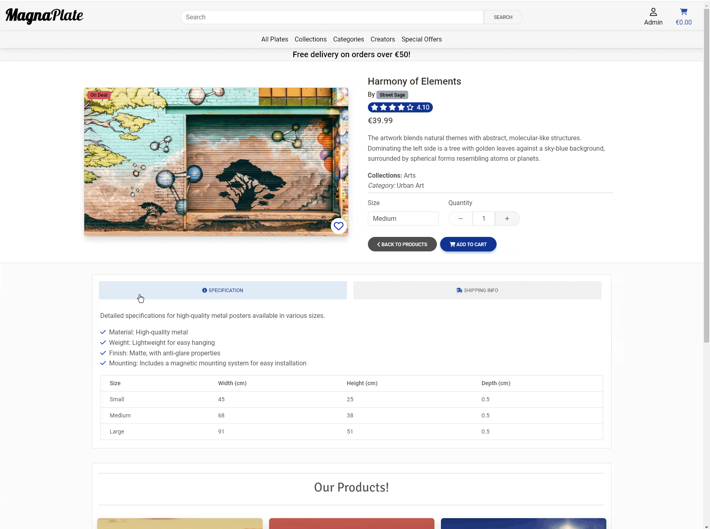
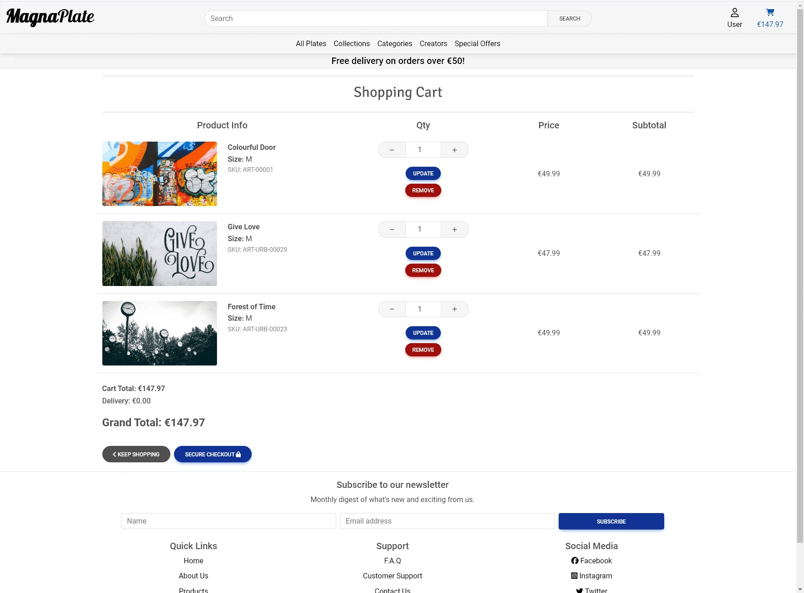
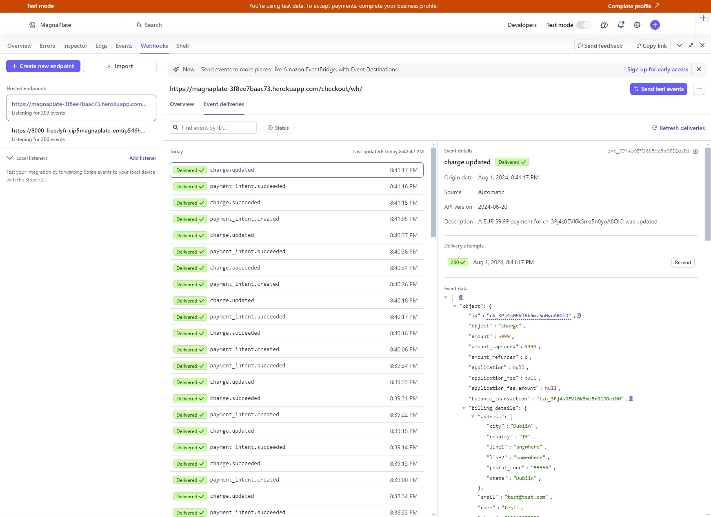
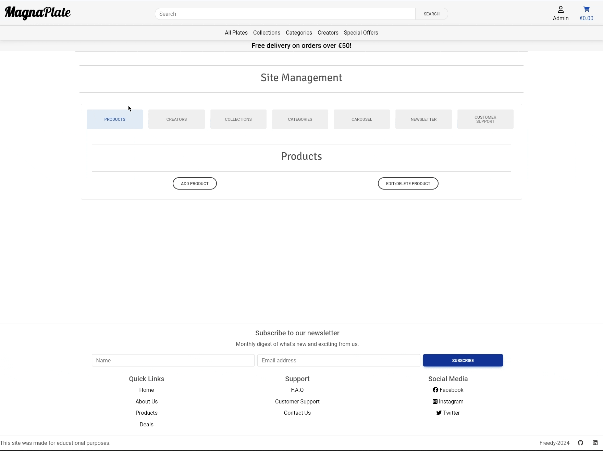
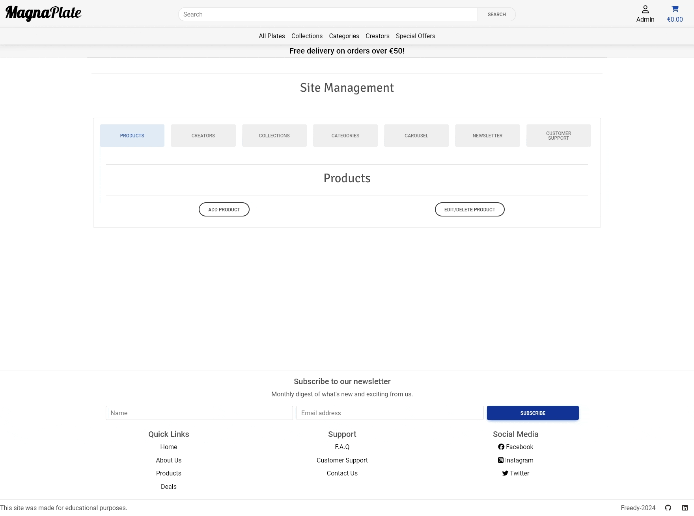
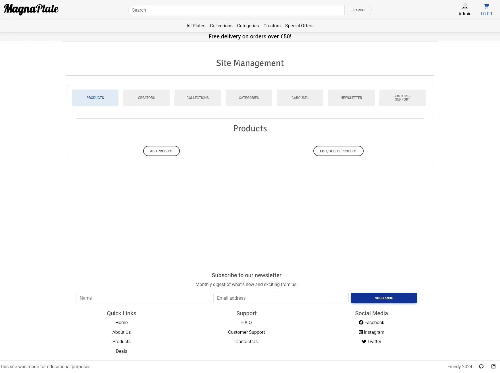
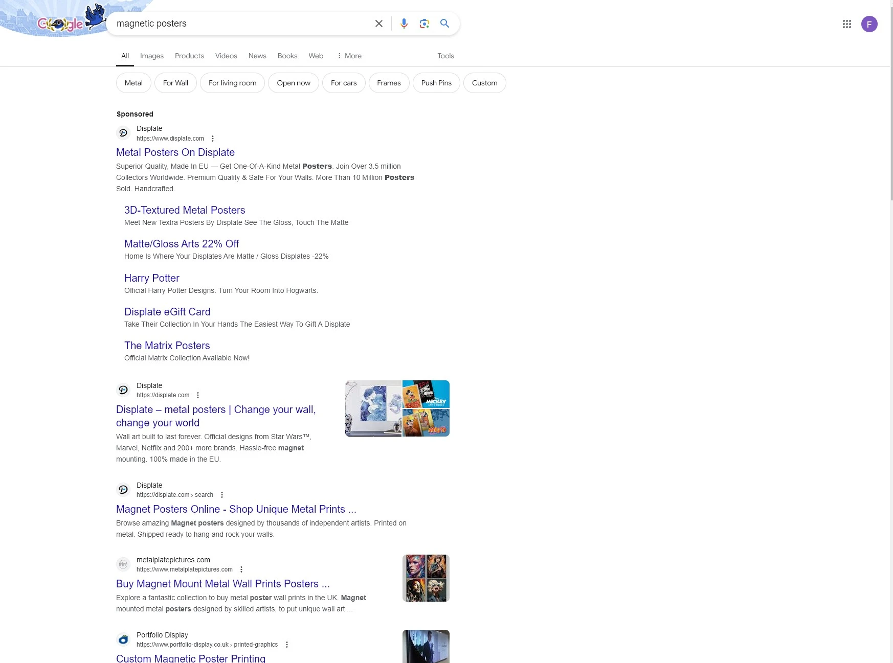

# Testing

## Table of Contents

- [Testing](#testing)
  - [Test Cases](#test-cases)
  - [Manual Testing with User Stories](#manual-testing)
  - [Bugs and Fixes](#bugs-and-fixes)
- [Validation](#validation)
  - [W3C](#w3c)
  - [Python Linter](#python-linter)
  - [wave.webaim](#wavewebaim)
  - [jigsaw.w3](#jigsaww3)

## Test Cases

### TC001: Navigation, Theme Switch, Toast Messages, Consistent Style

**Test Steps:**
1. Visit the homepage and check links.
2. Switch between dark and light themes.
3. Perform actions that trigger notifications.
4. Review all pages for style consistency.

**Expected Result:**
- All links should work correctly and direct the user to the appropriate page.
- Theme changes successfully.
- Notifications are displayed correctly.
- Style is consistent across all pages and components.

### TC002: User Registration, Newsletter Section

**Test Steps:**
1. Register a new user.
2. Sign up for the newsletter.

**Expected Result:**
- User receives a verification email and can log in after verification.
- User receives confirmation of newsletter signup.

### TC003: User Login, Logout, Profile Page

**Test Steps:**
1. Log in with a registered account.
2. Log out.
3. Access the profile page.
4. Access the order management page.

**Expected Result:**
- User is redirected to the profile page.
- User is successfully logged out.
- User can view and manage personal information.
- User can review and manage previous orders.

### TC004: Search Bar, Products Page, All Creators Page

**Test Steps:**
1. Use the search bar to find a product.
2. View paginated list of products.
3. View list of creators and click for details.

**Expected Result:**
- Search results display relevant products.
- Products are displayed in a paginated list.
- Creator details and related products are displayed.

### TC005: Product Details, My Favorites, Shopping Cart, Reviews

**Test Steps:**
1. View detailed product information and add to cart.
2. Add a product to the favorites.
3. Leave a review and rating.
4. Add a product to the cart, update quantities, remove items.

**Expected Result:**
- Product details are displayed correctly.
- Product appears in the favorites with correct details.
- Review and rating are submitted successfully.
- Product appears in the cart with correct details, updated quantities, and items removed as expected.

### TC006: Checkout, Stripe Payments

**Test Steps:**
1. Complete the checkout process.

**Expected Result:**
- Checkout completes, and order confirmation email is sent.

### TC007: Add Product, Collection, Creator, Category, Carousel Management

**Test Steps:**
1. Add a new product, collection, creator, category, carousel item.

**Expected Result:**
- Product, collection, creator, category, carousel item is listed correctly.

### TC008: Edit Product, Collection, Creator, Category

**Test Steps:**
1. Edit an existing product, collection, creator, category.

**Expected Result:**
- Changes are reflected correctly.

### TC009: Delete Product, Collection, Creator, Category

**Test Steps:**
1. Delete a product, collection, creator, category.

**Expected Result:**
- Product, collection, creator, category is removed correctly.

## Manual Testing with User Stories

### As a Site User

| ID | User Story | Feature | Test Case ID | Test Steps | Expected Result | Actual Result | Status | Comments | GIF/Link |
| --- | --- | --- | --- | --- | --- | --- | --- | --- | --- |
| [2](https://github.com/Freedy-FR/CI-P5-MagnaPlate/issues/2) | As a Site User, I can view top navigation for easy access to website main functions. | Navigation Bar | TC001 | Visit the homepage and check links. | All links should work correctly and direct the user to the appropriate page. | All links worked correctly and directed to the appropriate pages. | Pass | - | 

Navigation Bar

  |
| [3](https://github.com/Freedy-FR/CI-P5-MagnaPlate/issues/3) | As a Site User, I can view the main navigation for easy access to products and deals. | Navigation Bar | TC001 | Visit the homepage and check links. | All links should work correctly and direct the user to the appropriate page. | All links worked correctly and directed to the appropriate pages. | Pass | - | 

Navigation Bar

  |
| [4](https://github.com/Freedy-FR/CI-P5-MagnaPlate/issues/4) | As a Site User, I can register, log in, and log out to access the main features of the website. | User Registration, User Login, Logout Page | TC002, TC003 | Register a new user, log in with a registered account, log out. | User receives a verification email and can log in after verification. User is redirected to the profile page. User is successfully logged out. | User received a verification email and logged in successfully. User was redirected to the profile page. User was successfully logged out. | Pass | - | 

Register Page

 

Login Page

 

Logout Page

  |
| [5](https://github.com/Freedy-FR/CI-P5-MagnaPlate/issues/5) | As a Site User, I can use a search system for easy access to specific products and deals. | Search Bar | TC004 | Use the search bar to find a product. | Search results display relevant products. | Search results displayed relevant products. | Pass | - | 

Search Bar

  |
| [6](https://github.com/Freedy-FR/CI-P5-MagnaPlate/issues/6) | As a Site User, I can view a carousel of images on the main page to see the main deals and collections. | Home Page - Images Carousel | TC001 | Visit the homepage and check links. | Carousel displays main deals and collections. | Carousel displayed main deals and collections correctly. | Pass | - | 

Images Carousel

  |
| [7](https://github.com/Freedy-FR/CI-P5-MagnaPlate/issues/7) | As a Site User, I can view detailed product information, images, and options to buy or add to favorites. | Product Details | TC005 | View detailed product information and add to cart. | Product details are displayed correctly. | Product details were displayed correctly and added to cart successfully. | Pass | - | 

Product Details

 

My Favorites - Add Products

  |
| [8](https://github.com/Freedy-FR/CI-P5-MagnaPlate/issues/8) | As a Site User, I can add products to a favorites page for easy access to my favorite products. | My Favorites | TC005 | Add a product to the favorites. | Product appears in the favorites with correct details. | Product appeared in the favorites with correct details. | Pass | - | 

My Favorites

 

My Favorites - Add Products

 

My Favorites - Add Creators

  |
| [9](https://github.com/Freedy-FR/CI-P5-MagnaPlate/issues/9) | As a Site User, I can add products to the shopping cart, view purchase details, and complete the purchase. | Shopping Cart, Checkout | TC005, TC006 | Add a product to the cart and complete the checkout process. | Product appears in the cart with correct details. Checkout completes, and order confirmation email is sent. | Product appeared in the cart with correct details. Checkout completed, and order confirmation email was sent. | Pass | - | 

Shopping Cart

 

Checkout

 

Add to Cart

  |
| [10](https://github.com/Freedy-FR/CI-P5-MagnaPlate/issues/10) | As a Site User, I can sign up for a newsletter to receive email updates about new products. | Newsletter Section | TC002 | Sign up for the newsletter. | User receives confirmation of newsletter signup. | User received confirmation of newsletter signup. | Pass | - | 

Newsletter Section

  |
| [11](https://github.com/Freedy-FR/CI-P5-MagnaPlate/issues/11) | As a Site User, I can access my account profile page to manage personal information and preferences. | Profile Page | TC003 | Access the profile page. | User can view and manage personal information. | User was able to view and manage personal information. | Pass | - | 

Profile Page

  |
| [12](https://github.com/Freedy-FR/CI-P5-MagnaPlate/issues/12) | As a Site User, I can access the order management page to review and manage previous orders. | Profile Page | TC003 | Access the order management page. | User can review and manage previous orders. | User was able to review and manage previous orders. | Pass | - | 

Profile Page

  |
| [13](https://github.com/Freedy-FR/CI-P5-MagnaPlate/issues/13) | As a Site User, I can add products to the cart, preparing for purchase. | Shopping Cart | TC005 | Add a product to the cart. | Product appears in the cart with correct details. | Product appeared in the cart with correct details. | Pass | - | 

Shopping Cart

 

Add to Cart

  |
| [14](https://github.com/Freedy-FR/CI-P5-MagnaPlate/issues/14) | As a Site User, I can edit the contents of their shopping cart, including updating quantities. | Shopping Cart | TC005 | Edit the contents of the cart. | Cart contents update correctly. | Cart contents updated correctly. | Pass | - | 

Shopping Cart

  |
| [15](https://github.com/Freedy-FR/CI-P5-MagnaPlate/issues/15) | As a Site User, I can remove items from their shopping cart. | Shopping Cart | TC005 | Remove an item from the cart. | Item is removed from the cart. | Item was removed from the cart. | Pass | - | 

Shopping Cart

  |
| [16](https://github.com/Freedy-FR/CI-P5-MagnaPlate/issues/16) | As a Site User, I can view a paginated list of products to easily select a product for viewing. | Products Page | TC004 | View paginated list of products. | Products are displayed in a paginated list. | Products were displayed in a paginated list. | Pass | - | 

Products Page

  |
| [17](https://github.com/Freedy-FR/CI-P5-MagnaPlate/issues/17) | As a Site User, I can switch between dark and light themes for optimal viewing in different lighting environments. | Theme Switch | TC001 | Switch themes. | Theme changes successfully. | Theme changed successfully. | N/A | Future Iteration | N/A |
| [18](https://github.com/Freedy-FR/CI-P5-MagnaPlate/issues/18) | As a Site User, I can see site notifications to receive feedback on my actions. | Toast Messages | TC001 | Perform actions that trigger notifications. | Notifications are displayed correctly. | Notifications were displayed correctly. | Pass | - | 

Toast Messages

  [Toast Messages](/README.md#toast-messages) |
| [19](https://github.com/Freedy-FR/CI-P5-MagnaPlate/issues/19) | As a Site User, I have the option to leave product reviews and ratings. | Product Details | TC005 | Leave a review and rating. | Review and rating are submitted successfully. | Review and rating were submitted successfully. | N/A | Future Iteration | N/A |
| [24](https://github.com/Freedy-FR/CI-P5-MagnaPlate/issues/24) | As a Site User, I can view a footer for easy access to website functions. | Footer | TC001 | Visit the homepage and check links. | Footer links work correctly. | Footer links worked correctly. | Pass | - | 

Footer

  |
| [25](https://github.com/Freedy-FR/CI-P5-MagnaPlate/issues/25) | As a Site User, I can use a sorting system for easy access to specific products and deals. | Products Page - Sorting | TC004 | Use the sorting system. | Products are sorted correctly. | Products were sorted correctly. | Pass | - | 

Products Page - Sorting

  |
| [30](https://github.com/Freedy-FR/CI-P5-MagnaPlate/issues/30) | As a Site User, I can access the Carousel management page to review and manage the images and text on the carousel. | Carousel Management | TC007 | Manage carousel items. | Carousel items are managed successfully. | Carousel items were managed successfully. | Pass | - | 

Carousel Management - Add

 

Carousel Management - Edit

 

Carousel Management - Delete

  |
| [31](https://github.com/Freedy-FR/CI-P5-MagnaPlate/issues/31) | As a Site User, I can see a list of all creators and click on them to see more details and their related products. | All Creators Page, Creators Details | TC004, TC005 | View list of creators and click for details. | Creator details and related products are displayed. | Creator details and related products were displayed. | Pass | - | 

All Creators Page

 

Creators Details

  |
| [32](https://github.com/Freedy-FR/CI-P5-MagnaPlate/issues/32) | As a Site User, I want the project's style to be consistent across all pages and components, so that the user experience is seamless and professional. | Consistent Style | TC001 | Review all pages for style consistency. | Style is consistent across all pages and components. | Style was consistent across all pages and components. | Pass | - | N/A |

### As a Site Admin

| ID | User Story | Feature | Test Case ID | Test Steps | Expected Result | Actual Result | Status | Comments | GIF/Link |
| --- | --- | --- | --- | --- | --- | --- | --- | --- | --- |
| [20](https://github.com/Freedy-FR/CI-P5-MagnaPlate/issues/20) | As a Site Admin, I can process payments using the Stripe gateway. | Stripe Payments | TC006 | Complete the checkout process. | Checkout completes, and order confirmation email is sent. | Checkout completed, and order confirmation email was sent. | Pass | - | 

Stripe Payments

 

Order Confirmation Email

  |
| [21](https://github.com/Freedy-FR/CI-P5-MagnaPlate/issues/21) | As a Site Admin, I can add new products to the website's database. | Add Product (Admin) | TC007 | Add a new product. | Product is listed on the products page. | Product was listed on the products page. | Pass | - | 

Add Product

  |
| [22](https://github.com/Freedy-FR/CI-P5-MagnaPlate/issues/22) | As a Site Admin, I can delete products from the website's database. | Delete Product (Admin) | TC009 | Delete a product. | Product is removed from the products page. | Product was removed from the products page. | Pass | - | 

Delete Product

  |
| [23](https://github.com/Freedy-FR/CI-P5-MagnaPlate/issues/23) | As a Site Admin, I can edit and update product information in the website's database. | Edit Product (Admin) | TC008 | Edit an existing product. | Changes are reflected on the product detail page. | Changes were reflected on the product detail page. | Pass | - | 

Edit Product

  |
| [26](https://github.com/Freedy-FR/CI-P5-MagnaPlate/issues/26) | As a Site Admin, I can add, remove or edit collections to the website's database. | Collection Management | TC007, TC008, TC009 | Add, edit, and delete collections. | Collection management works correctly. | Collection management worked correctly. | Pass | - | 

Add Collection

 

Edit Collection

 

Delete Collection

  |
| [28](https://github.com/Freedy-FR/CI-P5-MagnaPlate/issues/28) | As a Site Admin, I can add, remove or edit creators to the website's database. | Creator Management | TC007, TC008, TC009 | Add, edit, and delete creators. | Creator management works correctly. | Creator management worked correctly. | Pass | - | 

Add Creator

 

Edit Creator

 

Delete Creator

  |
| [29](https://github.com/Freedy-FR/CI-P5-MagnaPlate/issues/29) | As a Site Admin, I can add, remove or edit categories to the website's database. | Category Management | TC007, TC008, TC009 | Add, edit, and delete categories. | Category management works correctly. | Category management worked correctly. | Pass | - | 

Add Category

 

Edit Category

 

Delete Category

  |

### As a Developer

| ID | User Story | Feature | Test Case ID | Test Steps | Expected Result | Actual Result | Status | Comments | GIF/Link |
| --- | --- | --- | --- | --- | --- | --- | --- | --- | --- |
| [33](https://github.com/Freedy-FR/CI-P5-MagnaPlate/issues/33) | As a Developer, I want the codebase to follow consistent coding standards, so that it is easy to maintain, understand, and collaborate on. | Consistent Coding Standards | TC001 | Review codebase for consistency. | Codebase follows consistent standards. | Codebase followed consistent standards. | Pass | - | N/A |
| [34](https://github.com/Freedy-FR/CI-P5-MagnaPlate/issues/34) | As a Developer, I want to implement SEO best practices on our website, so that the website ranks higher in search engine results and attracts more organic traffic. | SEO Implementation | TC001 | Implement SEO best practices. | Website ranks higher in search engine results. | Website ranked higher in search engine results. | Pass | - | 

SEO - Google

  |
| [35](https://github.com/Freedy-FR/CI-P5-MagnaPlate/issues/35) | As a Developer, I want a comprehensive documentation system so that it is easy to understand, maintain, and collaborate on the codebase. | Comprehensive Documentation | TC001 | Review documentation for comprehensiveness. | Documentation is comprehensive and easy to understand. | Documentation was comprehensive and easy to understand. | Pass | - | N/A |

## Bugs and Fixes

### Identified Bugs

1. **Bug:** Navigation bar links do not work correctly on mobile devices.
   - **Fix:** Adjust the CSS and JavaScript for the mobile navigation bar to ensure the links function properly.

2. **Bug:** Product images do not load on the product details page.
   - **Fix:** Ensure the correct path is set for product images and check if the images are uploaded correctly to the server.

### Fixed Bugs

1. **Bug:** There was a JavaScript error preventing the carousel from functioning correctly.

   - **Error Message:** Uncaught TypeError: Cannot read properties of undefined (reading 'keyboard')
   - **Solution:** The error was caused by an incorrect reference to the 'keyboard' property. Updating the JavaScript code to correctly handle the 'keyboard' property resolved the issue.

      

Error Before

      
      

      

Console Error

      
      

      

Error Corrected

      
      

       

2. **Bug:** The footer content does not span the full width of the page, causing alignment issues.

   - **Solution:** After reviewing the footer HTML structure, I discovered that the CSS classes applied to the footer div were not correctly set. Updating the CSS classes to ensure the footer spans the full width resolved the issue.

      

Code Before

      
      

      

Code After

      
      

       

3. **Bug:** Add to Cart functionality was not correctly updating cart contents for different product sizes.

   - **Solution:** Updated the `AddToCartView` class to ensure cart contents are modified correctly when a product with specific sizes is added.

      

Code Before

      
      

      

Code After

      
      

       

4. **Bug:** The product list view did not correctly filter and sort products based on query parameters.

   - **Solution:** Updated the `get_queryset` method in the `FilteredProductListView` class to properly handle filtering and sorting logic based on query parameters.

      

View Code Before

      
      

      

View Code After

      
      

      

Home Code Before

      
      

      

Home Code After

      
      

       

5. **Bug:** The search bar was not displaying the correct results for product searches.

   - **Solution:** Fixed the search query logic and adjusted the search bar to correctly filter and display results based on the user's input. The `FilteredProductListView` class was updated to handle search parameters properly and return accurate results.

      

Search Bar Before

      
      

      

Search Bar After

      
      

      

Search Results Before

      
      

      

Search Results After

      
      

       

6. **Bug:** URL routing issue was causing incorrect page loads for product views.

   - **Solution:** Updated the URL configuration to correctly route requests to the appropriate view.

      

URL Code Before

      
      

      

URL Code After

      
      

      

Page Before

      
      

      

Page After

      
      

       

7. **Bug:** Incorrect handling of new arrivals in product listing.

   - **Solution:** Updated the `get_queryset` method to properly filter and display new arrivals.

      

Code Before

      
      

      

Code After

      
      

       

## Validation

### W3C

W3C validation was performed to ensure that the HTML and CSS code follows the web standards.

### Python Linter

A Python linter was used to ensure that the Python code follows the PEP 8 standards.

### wave.webaim

wave.webaim was used to ensure that the website is accessible to users with disabilities.

### jigsaw.w3

jigsaw.w3 was used to validate the CSS code to ensure it follows the web standards.
